# WhatsApp Clone

<details close>
  <summary>Uygulamaya ait ekran görüntülerini görmek için tıklayın.</summary>
  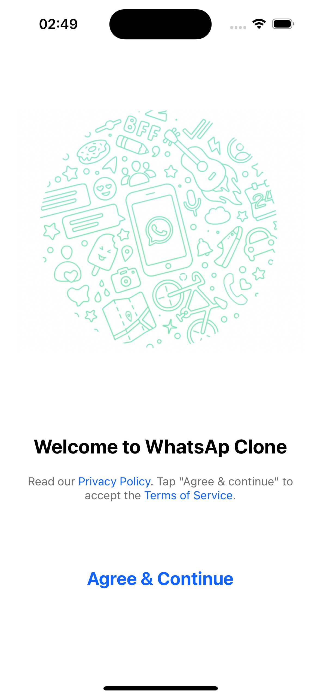 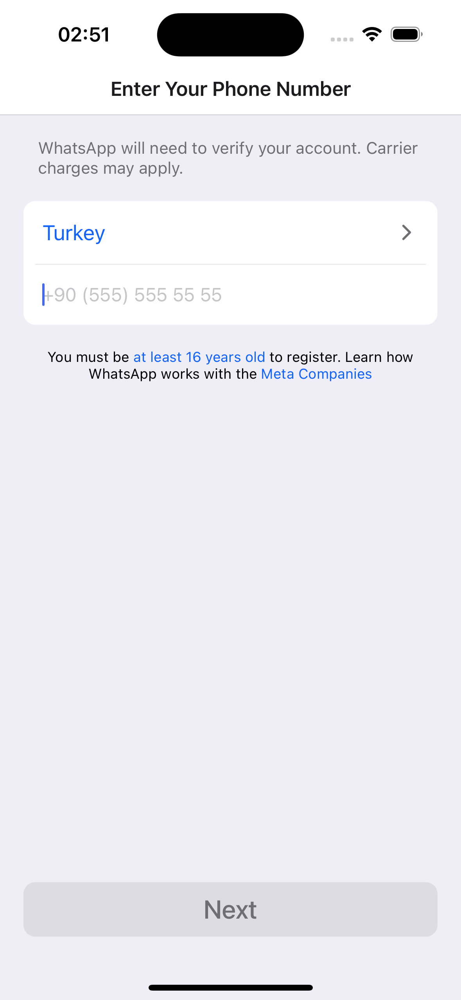 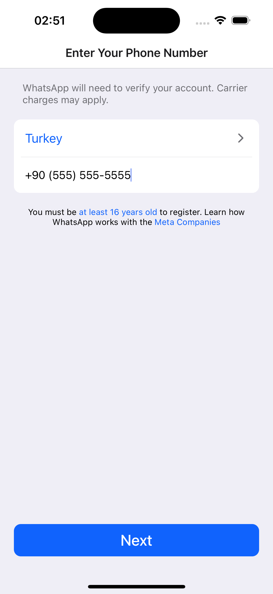 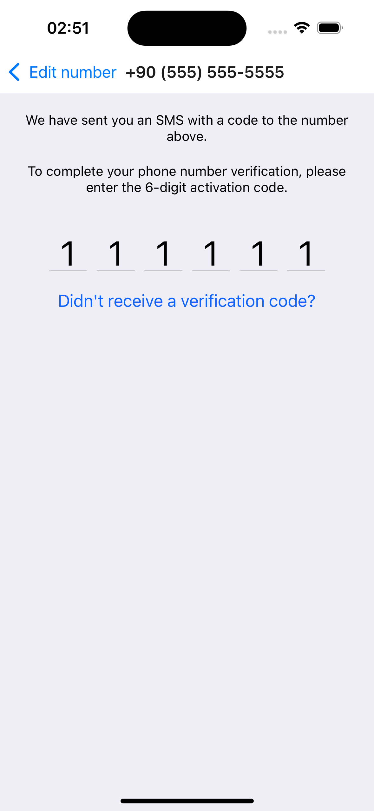 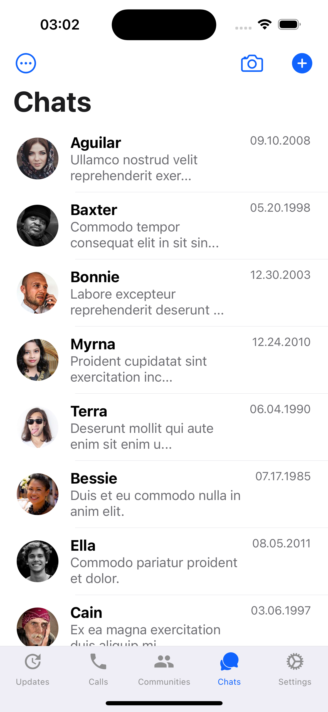
  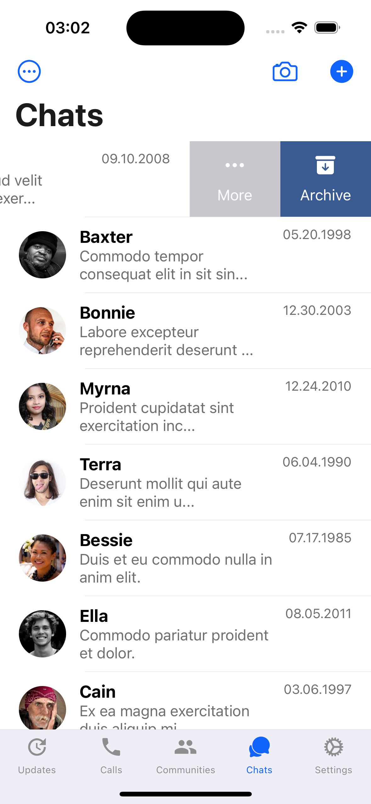 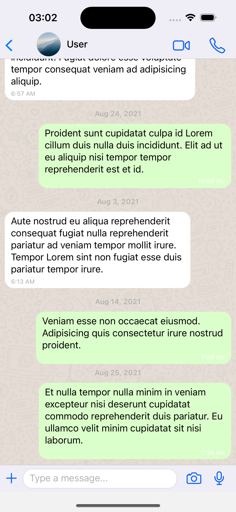 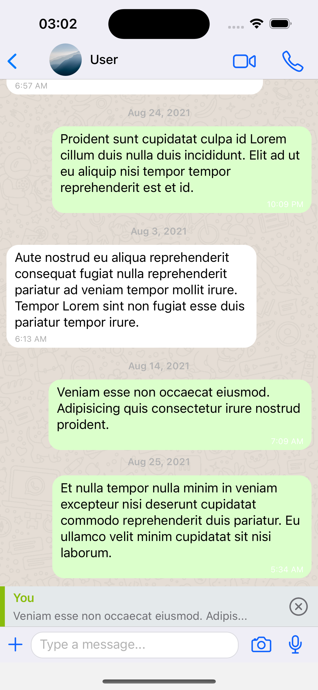 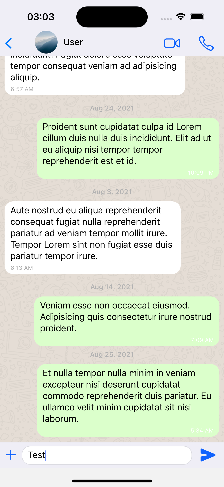 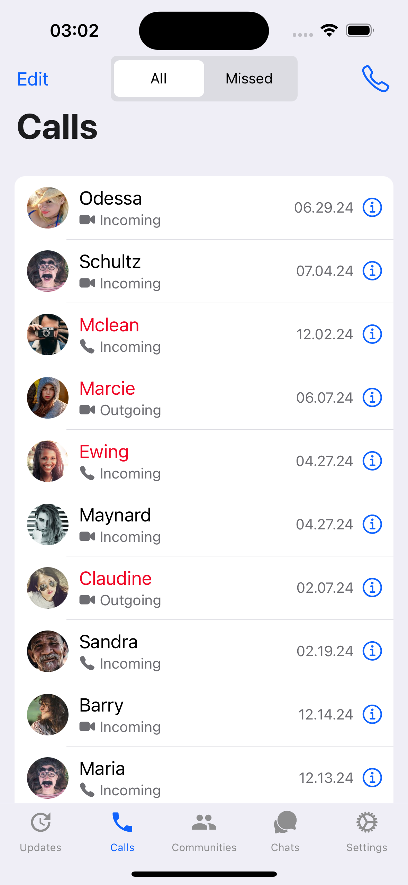
  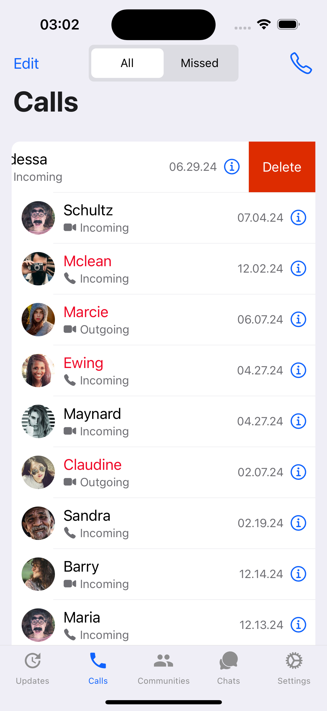 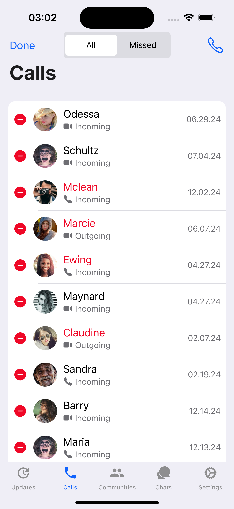 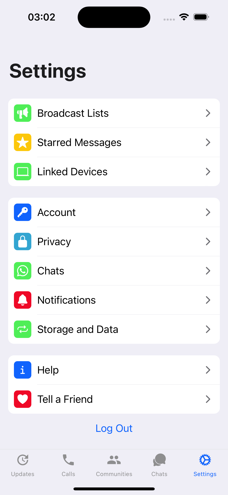
</details>

## Teknoloji

React Native Expo

## Tools

- Expo Router
- Expo Secure Store
- Reanimated
- Clerk

## Özellikler

- Clerk kullanılarak OTP ile giriş yapabilmek.
- WhatsApp UI Clone.

## Kurulum

Bu depoyu yerel makinenizde klonlayın.

```
git clone https://github.com/ibrahimaykutbas/whatsapp-clone.git
```

### Hazırlık

Projeyi klonladıktan sonra ilgili dizine gidin.

```
cd whatsapp-clone
code .
```

Proje bağımlılıklarını yüklemek için proje dizininde aşağıdaki komutları çalıştırın.

```
npm install
-veya-
yarn
```

Eğer macOS kullanıyorsanız ve iOS işletim sistemine sahip bir cihazda projeyi başlatacaksanız pod'ları yükleyin.

```
cd ios
pod install
```

### Kullanım

Projeyi başlatmak için aşağıdaki komutları kullanın.

```
npm run android
-veya-
npm run ios
```

Bu talimatlar, geliştirme ve test amacıyla yerel makinenizde projenin bir kopyasını hazır ve çalışır hale getirecektir.

## Daha Fazla Bilgi İçin

Daha fazlasını şuradan öğrenebilirsiniz: [React documentation](https://reactnative.dev/)
